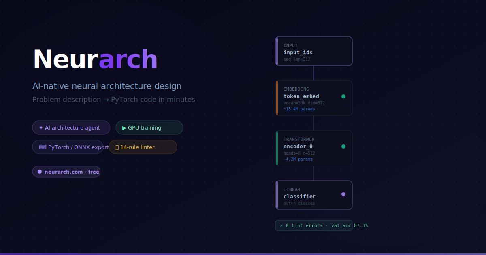

# Neurarch

### Design, train, and ship ML models — without writing boilerplate.

A visual AI/ML studio: drag together an architecture on a canvas, let an AI agent write the model from a sentence, train on cloud GPUs, and export production-ready PyTorch code in one click.

**[🚀 Try Neurarch at neurarch.com →](https://neurarch.com)**

**English** · [中文](./README.zh-CN.md)

---

## 📬 About this repo

This is the public home for **bug reports, feature requests, and discussions** about Neurarch. If you're looking for the product itself, head to **[neurarch.com](https://neurarch.com)**.

## 🗣 File feedback

| | |
|---|---|
| 🐛 **[Report a bug](https://github.com/neurarch-ai/neurarch-feedback/issues/new?template=bug_report.yml)** | Something is broken or behaving unexpectedly. |
| 💡 **[Request a feature](https://github.com/neurarch-ai/neurarch-feedback/issues/new?template=feature_request.yml)** | An idea that would make Neurarch better. |
| ❓ **[Ask a question](https://github.com/neurarch-ai/neurarch-feedback/issues/new?template=question.yml)** | Something specific you can't figure out. |
| 💬 **[Start a discussion](https://github.com/neurarch-ai/neurarch-feedback/discussions)** | Open-ended ideas, design feedback, "how would you…". |

## 🗺 Roadmap

The **[Issues tab](https://github.com/neurarch-ai/neurarch-feedback/issues)** is the de-facto roadmap. 👍 reactions on issues directly influence what gets built next — please vote on the things you care about.

---

## 🧠 What is Neurarch?

Neurarch turns ML model development into a visual workflow. Instead of wiring layers together in PyTorch by hand, you compose architectures on a canvas, ask an AI agent to extend them, and export real, runnable code when you're done.

### What you can do

- 🎨 **Visual model architect** — drag, connect, and configure layers on an infinite canvas. Live shape inference catches dimension mismatches as you build.
- 🤖 **AI agent** — describe what you want in plain English ("a small ResNet for CIFAR-10") and get a working architecture you can edit.
- 📦 **One-click code export** — generate clean PyTorch code, deploy bundles, an embeddable widget, or a runnable Colab notebook from any canvas.
- 🚀 **Cloud GPU training** — kick off training runs on Modal without touching any infra. Free signed-in tier gets simulation; Pro gets real GPUs.
- 📚 **Auto-generated docs** — turn your model into a model card, study guide, slide deck, or deploy README, customized for your audience.
- 🧩 **Templates & model zoo** — start from a known architecture (Transformer, U-Net, ViT, …) instead of a blank canvas.
- 🔑 **BYOK or managed** — use your own Claude / Gemini / Groq keys (kept in-browser only), or use our managed proxy on Pro.

For the full feature list, pricing, and a live demo, visit **[neurarch.com](https://neurarch.com)**.

---

## Before you file

- **Search existing issues first.** Someone may have already reported it.
- **One issue per topic.** Don't bundle multiple bugs into one ticket.
- **Be specific.** Browser + OS, exact steps to reproduce, what you expected vs. what happened. Screenshots and console errors are gold.
- **No general ML help.** This tracker is for Neurarch the product, not for debugging your own model.

## Other ways to reach us

- 📧 Email: **neurarch.ai@gmail.com** (private / billing / security)
- 𝕏 (Twitter): **[@NeurarchAI](https://x.com/NeurarchAI)**

## Code of conduct

Be kind. We're a small team building this in the open. Disrespectful, abusive, or spammy issues will be closed and the author blocked.

---

Made with ❤️ by the Neurarch team.

